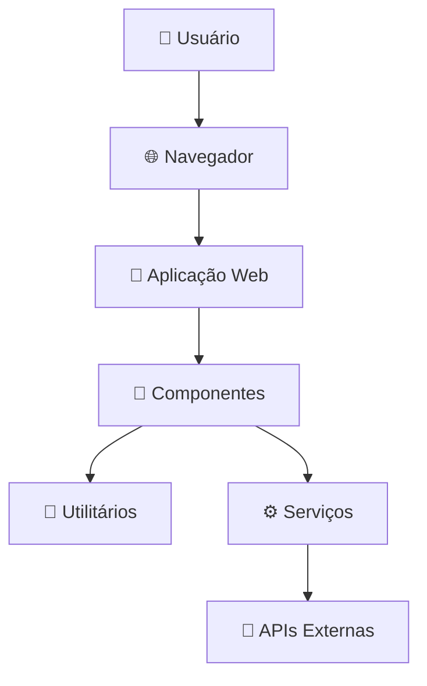

# Visão Geral da Arquitetura

Este documento descreve a arquitetura geral do sistema, suas principais decisões de design e como os componentes interagem.

## 📊 Arquitetura de Alto Nível



## 🏗️ Princípios Arquiteturais

### 1. Separação de Responsabilidades
Cada módulo tem uma responsabilidade específica e bem definida:

- **Componentes**: Interface do usuário e interações
- **Serviços**: Lógica de negócio e comunicação com APIs
- **Utilitários**: Funções auxiliares reutilizáveis
- **Estilos**: Apresentação visual e layout

### 2. Modularidade
```
src/
├── components/     # Componentes reutilizáveis
│   ├── ui/        # Componentes de interface básica
│   └── features/  # Componentes específicos de funcionalidades
├── services/      # Serviços de negócio
├── utils/         # Utilitários e helpers
└── styles/        # Estilos globais e temas
```

### 3. Dependency Injection
```javascript
// ✅ Bom: Injeção de dependências
class UserService {
  constructor(apiClient) {
    this.apiClient = apiClient;
  }
  
  async getUser(id) {
    return this.apiClient.get(`/users/${id}`);
  }
}

// ❌ Ruim: Dependência hard-coded
class UserService {
  async getUser(id) {
    return fetch(`/api/users/${id}`);
  }
}
```

## 🔄 Fluxo de Dados

### Padrão Unidirecional
```
Interface ➜ Eventos ➜ Serviços ➜ Estado ➜ Interface
```

### Exemplo Prático
```javascript
// 1. Interface captura evento
button.addEventListener('click', handleUserClick);

// 2. Handler processa evento
async function handleUserClick() {
  const userData = await userService.fetchUser();
  updateUserInterface(userData);
}

// 3. Interface é atualizada
function updateUserInterface(userData) {
  document.getElementById('user-name').textContent = userData.name;
}
```

## 🧩 Componentes Principais

### 1. Application Core
**Responsabilidade**: Inicialização e configuração global

```javascript
// src/main.js
import { App } from './app.js';
import { configureServices } from './config/services.js';

// Configurar serviços globais
const services = configureServices();

// Inicializar aplicação
const app = new App(services);
app.init();
```

### 2. Component System
**Responsabilidade**: Componentes reutilizáveis da UI

```javascript
// src/components/user-card.js
export class UserCard {
  constructor(userData) {
    this.userData = userData;
    this.element = this.render();
  }
  
  render() {
    const card = document.createElement('div');
    card.className = 'user-card';
    card.innerHTML = `
      
      <h3>${this.userData.name}</h3>
      <p>${this.userData.email}</p>
    `;
    return card;
  }
}
```

### 3. Service Layer
**Responsabilidade**: Lógica de negócio e comunicação externa

```javascript
// src/services/user-service.js
export class UserService {
  constructor(apiClient) {
    this.apiClient = apiClient;
  }
  
  async getAllUsers() {
    const response = await this.apiClient.get('/users');
    return response.data;
  }
  
  async createUser(userData) {
    const response = await this.apiClient.post('/users', userData);
    return response.data;
  }
}
```

## 📱 Responsividade e Performance

### Mobile-First Approach
```css
/* Base (mobile) */
.component {
  padding: 1rem;
  font-size: 1rem;
}

/* Tablet */
@media (min-width: 768px) {
  .component {
    padding: 1.5rem;
    font-size: 1.1rem;
  }
}

/* Desktop */
@media (min-width: 1024px) {
  .component {
    padding: 2rem;
    font-size: 1.2rem;
  }
}
```

### Lazy Loading
```javascript
// Carregamento sob demanda
const loadComponent = async (componentName) => {
  const module = await import(`./components/${componentName}.js`);
  return module.default;
};
```

## 🔒 Segurança

### 1. Sanitização de Dados
```javascript
function sanitizeHTML(html) {
  const div = document.createElement('div');
  div.textContent = html;
  return div.innerHTML;
}
```

### 2. Validação de Input
```javascript
function validateEmail(email) {
  const regex = /^[^\s@]+@[^\s@]+\.[^\s@]+$/;
  return regex.test(email);
}
```

### 3. Content Security Policy
```html
<meta http-equiv="Content-Security-Policy" 
      content="default-src 'self'; script-src 'self' 'unsafe-inline';">
```

## 🧪 Testabilidade

### Estrutura para Testes
```javascript
// src/utils/__tests__/validation.test.js
import { validateEmail } from '../validation.js';

describe('validateEmail', () => {
  it('should validate correct email', () => {
    expect(validateEmail('test@example.com')).toBe(true);
  });
  
  it('should reject invalid email', () => {
    expect(validateEmail('invalid-email')).toBe(false);
  });
});
```

## 📈 Escalabilidade

### Padrões para Crescimento

1. **Micro-frontends Ready**: Estrutura modular permite divisão futura
2. **API-First**: Interface preparada para múltiplos backends
3. **Component Library**: Componentes reutilizáveis em projetos futuros
4. **Progressive Enhancement**: Funcionalidades adicionais sem quebrar o básico

### Metrics e Monitoring
```javascript
// Performance monitoring
const observer = new PerformanceObserver((list) => {
  list.getEntries().forEach((entry) => {
    console.log(`${entry.name}: ${entry.duration}ms`);
  });
});
observer.observe({ entryTypes: ['measure', 'navigation'] });
```

## 🎯 Próximos Passos

1. **Service Workers**: Para cache e offline-first
2. **Web Components**: Para maior reusabilidade
3. **TypeScript**: Para type safety
4. **Testing Framework**: Para cobertura automatizada
5. **CI/CD Pipeline**: Para deploy automatizado

---

Esta arquitetura foi desenhada para ser simples, mas escalável. Cada decisão prioriza a manutenibilidade e a experiência do desenvolvedor.